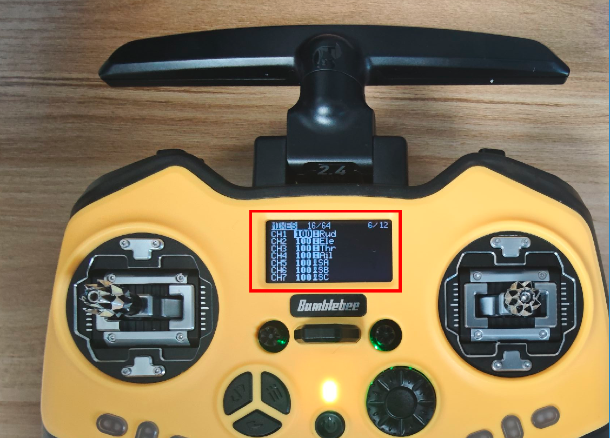
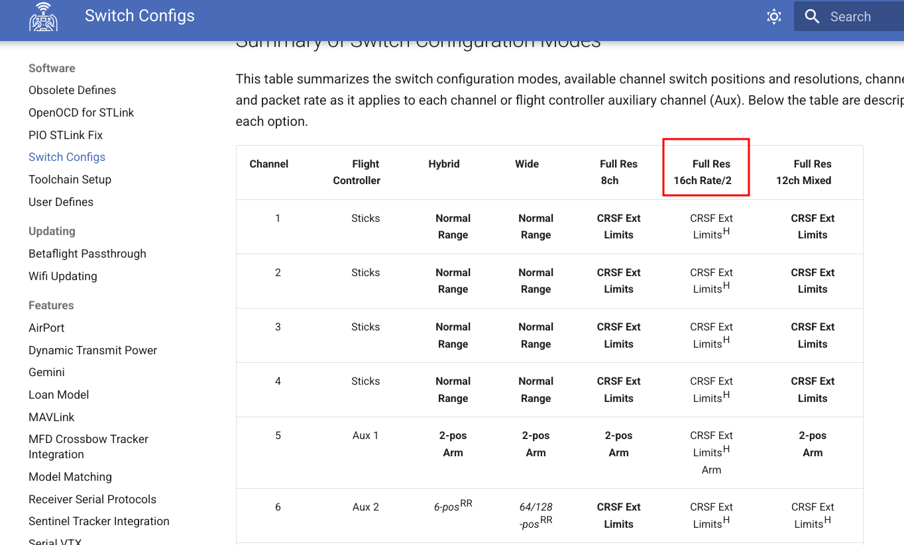
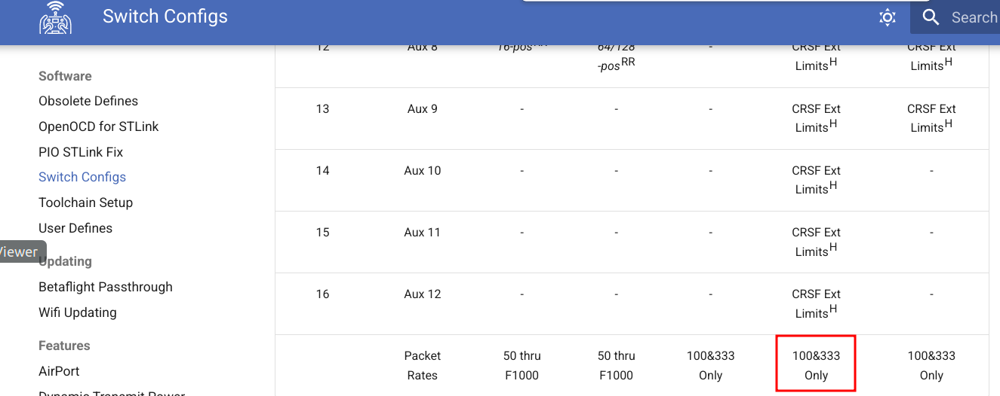
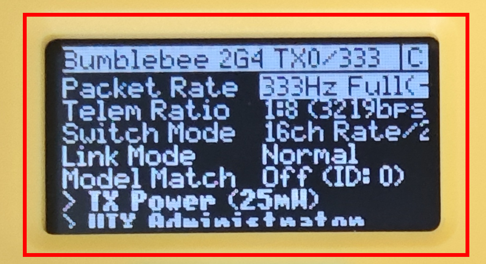

# 1.Description


**ROS 1** package for receiving CRSF (RC channels values) packets over serial port (UART).


**CRSF protocol** packet format [description](https://github.com/crsf-wg/crsf/wiki/Message-Format).


## Topics
    
- `rc/channels` - received rc channels values
- `rc/link` - connection statistics information


---

# 2.Installation


## 2.1 Dependencies:

Install `CppLinuxSerial` before:

```bash
git clone https://github.com/gbmhunter/CppLinuxSerial.git

cd CppLinuxSerial
mkdir build/
cd build
cmake ..
make
sudo make install
cd ../..
```


Let's assume that your ros workspace localized at `~/ros_ws/`.


## 2.2 Clone package from git:

```bash
cd ~/row2_ws/src

# Types dependency package:
git clone https://github.com/wanghuohuo0716/ros_crsf_receiver.git
```

## 2.3 Build

```bash
cd ~/ros_ws

colcon build --packages-select crsf_receiver_msg
colcon build --packages-select crsf_receiver
```

## 2.4 Re-source

```bash
source ~/ros_ws/devel/setup.bash
```

---


# 3.Running


## 3.1 Check the serial data is ok!

The CRSF receiver typically operates at a baud rate of **420,000**. While this speed is generally manageable on Windows **serial assistant**, it often poses challenges on Linux platforms. Standard serial communication tools like CuteCom may struggle to handle such high baud rates due to limitations in driver support and hardware compatibility.

Additionally, the performance of USB-to-TTL adapters can vary significantly. Some adapters may not reliably support baud rates as high as **420,000**, leading to data corruption or loss during transmission.

So, you have to change the receiver buand rate to a lower baund rate, now I set the baund rate **115200** for easy test.

It's easy to set the receiver baund rate by the [video](https://v.douyin.com/1VpiftP0xsg/), don't worry! 

After that, you will get the control data is like this :

`C8 18 16 E2 23 9F 2B C8 F7 8B F2 95 AF 7C E5 2B 5F F9 CA 07 00 00 4C 7C E2 BB`

the link data is like this:

`C8 0C 14 16 00 64 0B 00 09 02 00 00 00 B8`


## 3.2 Set up params:

check you device name:

`ls /dev/tty*`

get the authority

`sudo chmod 777 /dev/ttyUSB0`

1. Serial device name: `device`, default is `/dev/ttyUSB0`
2. Baud rate: `baud_rate`, default is `115200`
3. Enable / Disable link statistics info: `link_stats`, default is `false`
4. Receiver rate (hz): `receiver_rate`, default is `100`

note: if the device name is not `/dev/ttyUSB0` or baund rate is not `115200`, you have to change the code and rebuild.

## 3.2 Run ros node:

```bash
# Run Node with default parameters
source devel/setup.bash
rosrun crsf_receiver crsf_receiver_node

# Or setup and run Node with custom parameters values:
rosrun crsf_receiver crsf_receiver_node --ros-args -p "device:=/dev/serial0" -p baud_rate:=115200  -p link_stats:=true
```

## 3.3 Check

After correct setup and running without errors you can check topics:

```bash
# Check channels values
rostopic echo /rc/channels

# Check link statisics
rostopic echo /rc/link

# Check receiver rate
rostopic hz /rc/channels
```

CRSF sets the **midpoint value of the RC channels to [992](https://github.com/crsf-wg/crsf/wiki/CRSF_FRAMETYPE_RC_CHANNELS_PACKED)** for [specific reasons](https://www.expresslrs.org/software/switch-config/#hybrid-and-wide-switch-configuration-modes). It is recommended **NOT** to modify this default midpoint setting in the driver. Instead, perform any necessary value conversion in your own control code.


## 3.4 Link statistics message fields:

- `uplink_rssi_ant1` - ( dBm * -1 )
- `uplink_rssi_ant2` - ( dBm * -1 )
- `uplink_status` - Package success rate / Link quality ( % )
- `uplink_snr` - ( db )
- `active_antenna` - Diversity active antenna ( enum ant. 1 = 0, ant. 2 )
- `rf_mode` - ( enum 4fps = 0 , 50fps, 150hz)
- `uplink_tx_power` - ( enum 0mW = 0, 10mW, 25 mW, 100 mW, 500 mW, 1000 mW, 2000mW )
- `downlink_rssi` - ( dBm * -1 )
- `downlink_status` - Downlink package success rate / Link quality ( % )
- `downlink_snr` - ( db )


# 4.Remote controller setting

## 4.1 Channels remap
 By default, your transmitter is configured to output **only the four primary stick channels**: Rudder, Elevator, Throttle, and Aileron. To utilize additional switches or buttons on your transmitter, you need to map them to specific channels.

This mapping is done in the **Mixes page**, **not** in the **Inputs page**. In the Mixes page, you can assign switches, knobs, or sliders to output channels, allowing them to control various functions on your model. 



For detailed guidance on setting up these mappings, please refer to the official documentation or instructional videos.

## 4.2 Packet Rates

After completing step 4.1, you’ll see that channels 1–12 can be controlled properly, but channels 13–16 are not responsive. According to the [Switch Configs](
https://www.expresslrs.org/software/switch-config/#summary-of-switch-configuration-modes), the transmitter must be switched to 16-channel mode to enable all 16 channels mode.




To use 16 channels, the transmission rate must be set to either **100 Hz or 333 Hz**. At these settings, the data rate will be reduced to half of the preset speed. Additionally, the telemetry ratio should not be set too low—for example, 1:128 may cause frequent alarms on the transmitter. A ratio of 1:8 is generally more stable.



However, note that according to ExpressLRS specifications, [channels 15 and 16 are reserved for telemetry data](https://github.com/ExpressLRS/ExpressLRS/issues/2363?utm_source=chatgpt.com). As a result, only channels 13 and 14 can be used for additional control beyond the first 12 channels.



Note: When configuring the packet rate and channel settings, you may encounter the warning “error not while connected.” This happens because ELRS does not allow changing these parameters while the receiver is connected. Simply power off the receiver before applying the settings.


# 5.THANKS

THANKS AndreyTulyakov who provide the [ros2 version](https://github.com/AndreyTulyakov/ros2_crsf_receiver)!

This repo is modified from the [ros2 version](https://github.com/AndreyTulyakov/ros2_crsf_receiver)!